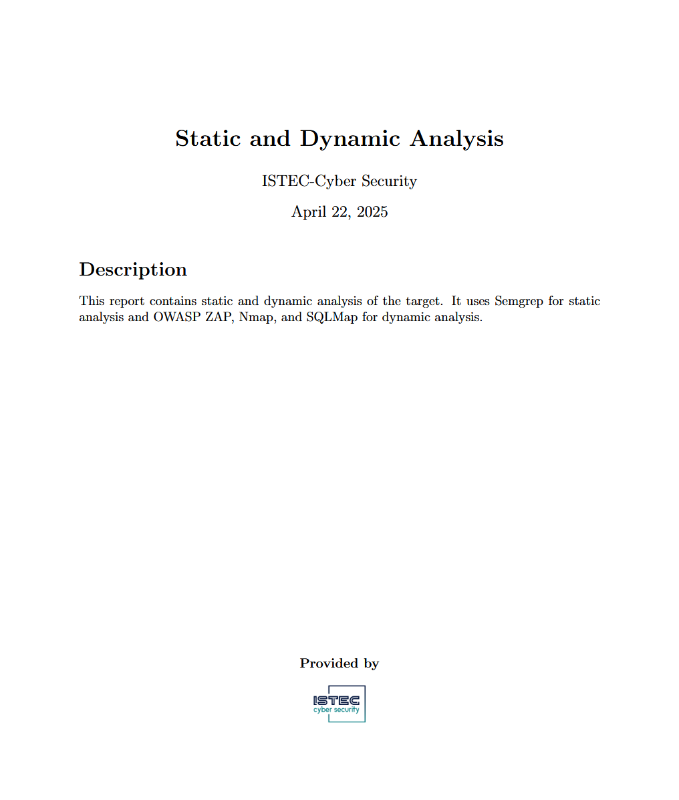
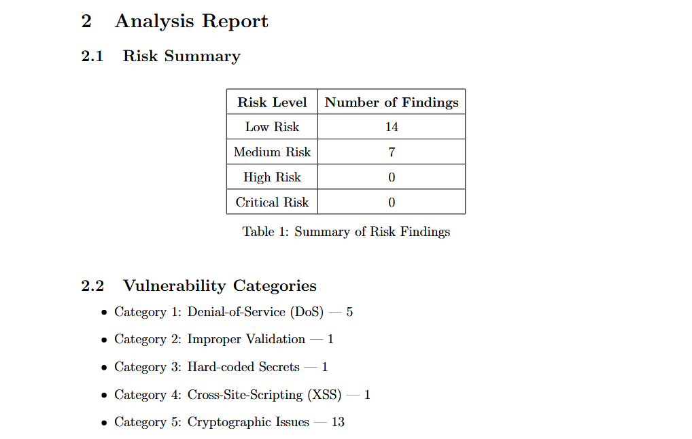
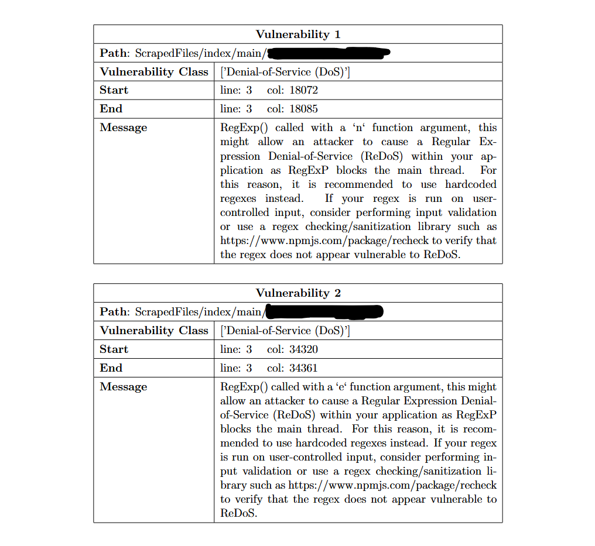

# WebScan
WebScan, a Python-based tool to download source files of web applications and analyse
them using Semgrep for static and nmap, sqlmap, OWASP ZAP for dynamic analysis. 
**Use WebScanREADME.docx for intallation and usage guide!!!**

We also used WebScan for "Exploring Common Web Vulnerabilities through Static Analysis with Semgrep" research.
**You can access this research in the WebScanPaper.pdf file.** This paper is accepted as a short paper in NTMS 2025 Paris Conference.

WebScan is an advanced web security scanning framework that integrates multiple tools and techniques to provide comprehensive vulnerability detection for web applications. It combines static analysis, dynamic scanning, and automated reporting to deliver detailed security insights.
Features

    Static Analysis using Semgrep for pattern-based source code analysis.

    Dynamic Scanning with:

        Nmap for network discovery and port scanning.

        SQLmap for automated SQL injection detection.

        OWASP ZAP for comprehensive web application vulnerability scanning.

    Automated report generation using LaTeX to produce professional PDF reports.

    HTML parsing and crawling using BeautifulSoup.

    Asynchronous web requests with aiohttp and asyncio for efficient scanning.

    JSON and XML parsing to process results from various scanners.

    Modular design with parsers for Nmap, SQLmap, ZAP, and Semgrep outputs.

Technologies & Libraries

    Python 3.x

    Playwright for browser automation and dynamic web crawling

    BeautifulSoup for HTML parsing

    Semgrep for static code analysis

    Nmap for network scanning

    SQLmap for automated SQL injection testing

    OWASP ZAP for web vulnerability scanning

    LaTeX for automated PDF report generation

    Async libraries: asyncio, aiohttp

System Output Example

